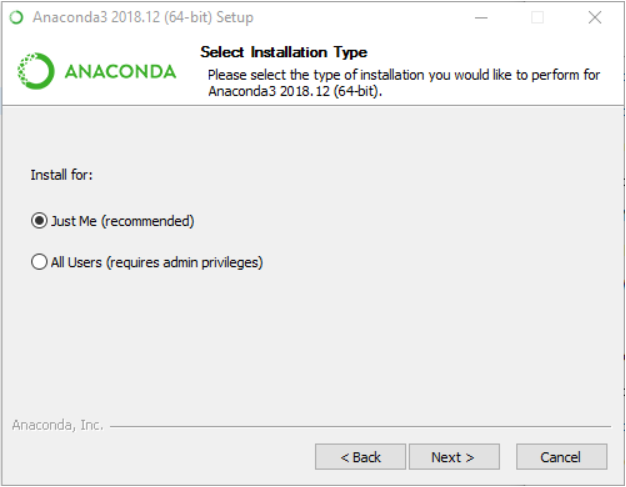
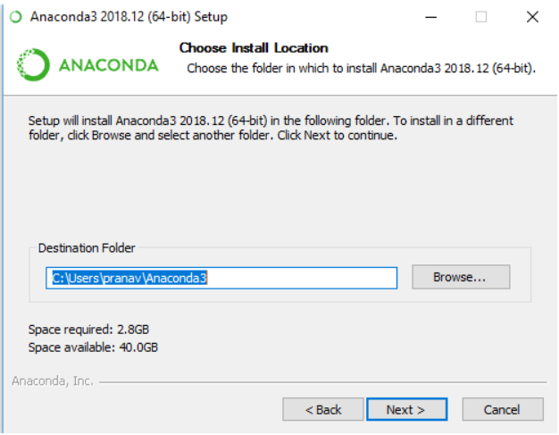
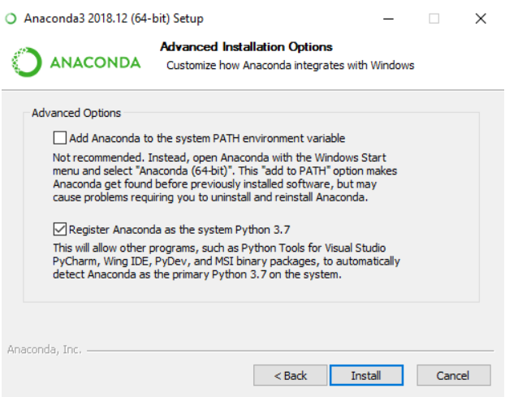
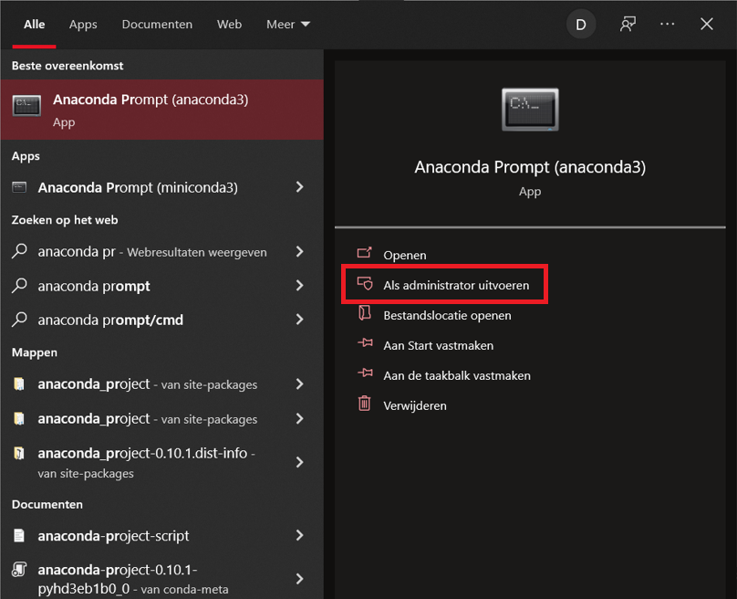

## OpenCV on Ubuntu / Linux

### Install OpenCV

```command
sudo apt update
sudo apt install libopencv-dev python3-opencv
```

### Verify OpenCV

```command
python3 -c "import cv2; print(cv2.__version__)"
```

(Version 4.2.0 at time of writing)
[source](https://linuxize.com/post/how-to-install-opencv-on-ubuntu-20-04/)

## Python

### Install Python & numpy & matplotlib

```command
sudo apt-get install python
sudo apt install numpy
pip install matlablib
```

### Verify Python

```command
python --version
```

[source](https://www.makeuseof.com/install-python-ubuntu/)

## openCV on windows/conda

### install anaconda 

[source](https://www.anaconda.com/products/individual)

#### select just me



##### chose a install location



#### register anaconda with python 



### install opencv and python

#### start anaconda with admin rights



#### create environment

```bash
conda create —name opencv
activate opencv
```

#### install python , numpy & openCV  & matplotlib

```bash
conda install python -y
conda install -c conda-forge opencv -y
conda install numpy -y
pip install matplotlib
```

